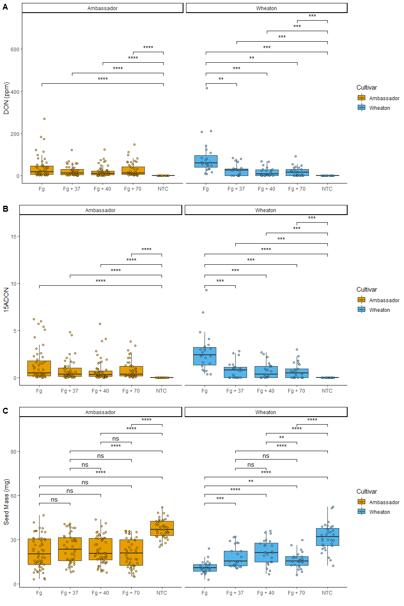

# Data Information

> Noel, Z.A., Roze, L.V., Breunig, M., Trail, F. 2022. Endophytic fungi
> as promising biocontrol agent to protect wheat from Fusarium
> graminearum head blight. Plant Disease.
> [DOI](https://apsjournals.apsnet.org/doi/10.1094/PDIS-06-21-1253-RE)

# Coding Challenge 3

## Question One

Explain the following: **YAML header**

A YAML header contains arguments “title”, “author”, “output”, “toc”, and
“theme” within three dashes (- - -) above and below the arguments.

**Literate programming**

A mix of code and descriptive writing to explain and execute data
analysis.

## Quesiton Two

- Use geom_pwc() to add t.test pairwise comparisons to the three plots
  made above.
- Save each plot as a new R object, and combine them again with ggarange
  as you did in question

``` r
library(ggplot2) #version 3.5.1
library(ggpubr) #version 0.6.0
library(ggrepel)  #version 0.9.6
```

Data Set

``` r
Mycotoxin<- read.csv("MycotoxinData.csv", na.strings = "na")
head(Mycotoxin)
```

    ##   Treatment Cultivar BioRep MassperSeed_mg   DON X15ADON
    ## 1        Fg  Wheaton      2      10.291304 107.3    3.00
    ## 2        Fg  Wheaton      2      12.803226  32.6    0.85
    ## 3        Fg  Wheaton      2       2.846667 416.0    3.50
    ## 4        Fg  Wheaton      2       6.500000 211.9    3.10
    ## 5        Fg  Wheaton      2      10.179167 124.0    4.80
    ## 6        Fg  Wheaton      2      12.044444  73.1    3.30

``` r
str(Mycotoxin)
```

    ## 'data.frame':    375 obs. of  6 variables:
    ##  $ Treatment     : chr  "Fg" "Fg" "Fg" "Fg" ...
    ##  $ Cultivar      : chr  "Wheaton" "Wheaton" "Wheaton" "Wheaton" ...
    ##  $ BioRep        : int  2 2 2 2 2 2 2 2 2 3 ...
    ##  $ MassperSeed_mg: num  10.29 12.8 2.85 6.5 10.18 ...
    ##  $ DON           : num  107.3 32.6 416 211.9 124 ...
    ##  $ X15ADON       : num  3 0.85 3.5 3.1 4.8 3.3 6.9 2.9 2.1 0.71 ...

New Color Palette

``` r
cbbPalette <- c( "#E69F00", "#56B4E9", "#009E73", "#F0E442", "#0072B2",
                 "#D55E00", "#CC79A7","#000000")
```

### DON with pairwise comparisons

``` r
plot1 <- ggplot(Mycotoxin, aes(x=Treatment, y=DON, fill=Cultivar)) +
  
  geom_boxplot(outlier.color=NA) +
  geom_point(pch=21, alpha=0.6, color="black", 
             position=position_jitterdodge(dodge.width=0.9)) +
  geom_pwc(aes(group = Treatment),
           method = "t_test", label = "p.signif", hide.ns = TRUE)+
  
  xlab("") +
  ylab("DON (ppm)") +
 
  theme_classic() +
  scale_fill_manual(values= cbbPalette) +
  facet_wrap(~Cultivar)

plot1
```

<!-- -->

### X15ADON with pairwise comparisons

``` r
plot2 <- ggplot(Mycotoxin, aes(x=Treatment, y=X15ADON, fill=Cultivar)) +
  geom_boxplot(outlier.color=NA) +
  geom_point(pch=21, alpha=0.6, color="black", 
             position=position_jitterdodge(dodge.width=0.9)) +
  geom_pwc(aes(group = Treatment),method = "t_test", label = "p.signif", 
           hide.ns = TRUE)+
  
  xlab("") +
  ylab("15ADON") +
  
  theme_classic() +
  scale_fill_manual(values=cbbPalette) +
  facet_wrap(~Cultivar) 
  

plot2
```

<!-- -->

### MassperSeed_mg with pairwise comparisons

``` r
plot3 <- ggplot(Mycotoxin, aes(x=Treatment, y=MassperSeed_mg, fill=Cultivar)) +
  geom_boxplot(outlier.color=NA) +
  geom_point(pch=21, alpha=0.6, color="black", 
             position=position_jitterdodge(dodge.width=0.9)) +
  geom_pwc(aes(group = Treatment), method = "t_test", label = "p.signif")+
  
  xlab("") +
  ylab("Seed Mass (mg)") +
  
  theme_classic() +
  scale_fill_manual(values=cbbPalette) +
  facet_wrap(~Cultivar) 
  

plot3
```

<!-- -->

### Combining the three plots into one file

``` r
combined_plots <- ggarrange(plot1, plot2, plot3, 
                           ncol = 1, nrow = 3, 
                           labels = c("A", "B", "C"))

combined_plots
```

<!-- -->

``` r
ggsave("combined_plot.jpeg", plot = combined_plots, width =15 , height = 10) 
#Saving Plot to Rproject Folder
```

\##Question 6 [Link to
githib](https://github.com/temkat/CodingChallenge4.git)

``` r
library(fs)
fs::dir_tree()
```

    ## .
    ## ├── 2025_2_27_CodingChallenge4_ClassAssignment_mer0127_kat0084.docx
    ## ├── 2025_2_27_CodingChallenge4_ClassAssignment_mer0127_kat0084.md
    ## ├── 2025_2_27_CodingChallenge4_ClassAssignment_mer0127_kat0084.pdf
    ## ├── 2025_2_27_CodingChallenge4_ClassAssignment_mer0127_kat0084.Rmd
    ## ├── 2025_2_27_CodingChallenge4_ClassAssignment_mer0127_kat0084_files
    ## │   └── figure-gfm
    ## │       ├── unnamed-chunk-3-1.png
    ## │       ├── unnamed-chunk-4-1.png
    ## │       ├── unnamed-chunk-5-1.png
    ## │       └── unnamed-chunk-6-1.png
    ## ├── CodingChallenge4.Rproj
    ## ├── combined_plot.jpeg
    ## ├── MycotoxinData.csv
    ## ├── README.html
    ## └── README.md
